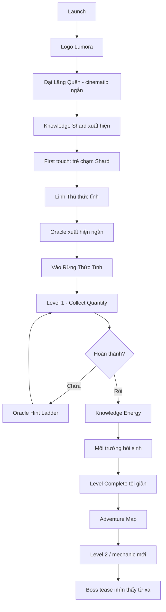
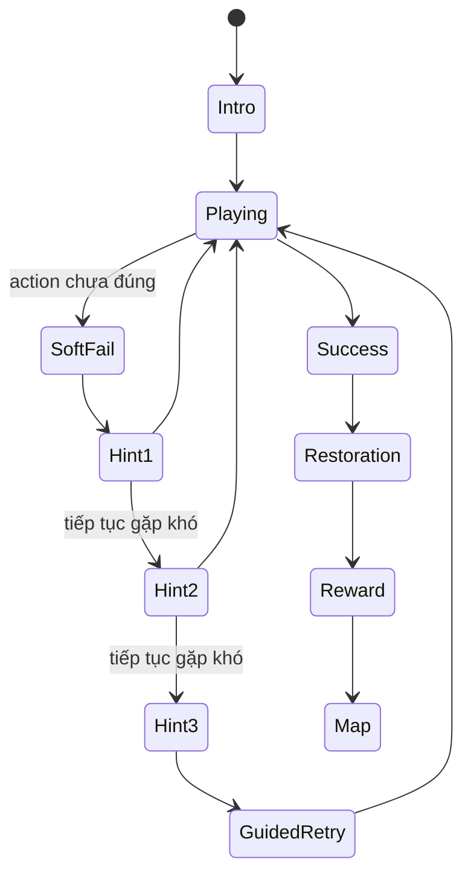

# 10 — UX Flow v0.1

## Mục tiêu

Khóa luồng trải nghiệm MVP trước khi engineering. Trẻ phải được tương tác trong vòng 60 giây đầu và hiểu mục tiêu chủ yếu bằng hình ảnh/animation/voice thay vì đoạn chữ dài.

## First 15-minute canonical flow



## Timing target

| Mốc | Target |
|---|---:|
| Logo + load | 0–5s |
| Intro context | 5–25s |
| First touch | <= 30–45s |
| Linh Thú thức tỉnh | <= 60s |
| Bắt đầu Level 1 | <= 90s |
| First restoration reward | 3–5 phút |
| Mechanic thứ hai | 5–8 phút |
| Boss/mystery tease | <= 15 phút |

## Navigation hierarchy MVP

```text
HOME
├── Tiếp tục hành trình (Primary)
│   └── Adventure Map
│       └── Level
│           ├── Oracle Hint
│           ├── Success / Restoration
│           └── Level Complete
├── Linh Thú
│   └── Progress / Evolution preview
└── Thành phố
    └── Knowledge City

Parent Dashboard: tách entry và giảm prominence trong child UI.
Settings: icon nhỏ, không cạnh tranh với CTA chính.
```

### Onboarding vào first session

Sau khi trẻ chạm Mảnh Tri Thức và hoàn tất hồ sơ tối thiểu, app mở một Oracle local ngắn trước khi vào `Adventure Map`. Trẻ có thể chọn `Bắt đầu Bãi Hạt Sáng` hoặc `Bỏ qua lời giới thiệu`; cả hai lựa chọn đều đưa thẳng vào Level 1 để giảm ma sát trong lần chơi đầu. Khi hoàn tất Level 1, restoration tiếp tục về `Adventure Map`; flow này chỉ là state local trong phiên, không ghi thêm curriculum approval, reward hay cloud state.

### First-session continuation

Sau restoration của Level 1, Map hiển thị một CTA riêng cho `Cổng Ghép Đôi` thay vì để trẻ tự đoán node kế tiếp. CTA mở `MechanicIntroView`, đọc objective/entry state/gesture từ interaction spec canonical, rồi chuyển sang Match Level 2. Khi Match hoàn tất, restoration mở một boss tease có nhãn `không mở khóa`; nút về Map chỉ hoàn tất mạch giới thiệu, không cấp thêm reward và không bỏ qua prerequisite. Back/refresh và event malformed đều quay về trạng thái an toàn, không dùng continuation để tạo completion giả.

### Mastery Arc trong vòng chơi

`Mastery Arc` nối cùng `skillId` qua Main Quest, Daily Adventure, Quest và phase tổng hợp. First-session target và Daily queue đọc registry/policy local deterministic; selector chỉ dùng node/skill/mastery evidence đã allowlist, không gửi PII và không tự tạo curriculum. Parent Dashboard hiển thị context đã gặp như bằng chứng thao tác giới hạn, không phải diagnosis.

### Resume Daily Adventure

`Daily Adventure` lưu một resume record local theo ngày với queue deterministic, challenge index, kết quả đã hoàn tất và phase hiện tại. Khi rời hoặc reload, Home hiển thị `Tiếp tục Daily Adventure`; nếu phiên đã sang ngày mới hoặc dữ liệu không hợp lệ, record bị bỏ qua fail-closed. Board đang thao tác không lưu snapshot nội bộ, nên resume sẽ trở lại checkpoint an toàn thay vì khôi phục trạng thái nửa chừng.

### Resume active play

Main Quest và nhiệm vụ tùy chọn có một active-play draft local-only riêng với `nodeId`, `questId` (nếu là quest), `phaseIndex`, `phaseCount` và timestamp. Draft được normalize lại bằng registry node/quest hiện tại; Home cho phép tiếp tục hoặc bắt đầu lại. Khi back khỏi board, draft vẫn giữ; khi hoàn thành hoặc content đã hoàn tất, draft bị xóa. Không lưu board internals, PII, reward hay cloud state.

## Child UI rules

- Một màn hình = một hành động chính.
- Mục tiêu phải có thể hiểu bằng visual trong 3–5 giây.
- Touch target lớn.
- Không quá 3 lựa chọn ngang hàng ở child-facing screen nếu không phải gameplay.
- Không yêu cầu đọc đoạn văn dài.
- Voice + animation hỗ trợ những instruction quan trọng.
- Không hiện nhiều currency cùng lúc.
- Khi kéo vật thể, chỉ vùng đích hợp lệ mới phát sáng; vùng vừa nhận vật thể có landing pulse ngắn để xác nhận hành động.
- Success burst giữ Nubi trong một lớp visual riêng, xếp copy hoàn thành bên dưới nhân vật và giới hạn theo viewport để không bị text chồng lên Nubi hoặc rơi khỏi màn hình.
- Nubi cộng hưởng theo Energy type đang luyện: dải màu là ambient cue trong board; khi nhận reward, resonance tăng intensity và copy reward chỉ rõ mạch năng lượng. Đây là feedback trực quan, không biến Energy thành hint đáp án.

### Nubi signal contract

Nubi có một signal nhỏ, ngắn và local để trẻ thấy game đang nhận hành động của mình:

```text
ambient (chờ)
  -> attention (soft-fail)
  -> responding (player-action / hint-requested)
  -> resonant (phase-complete / level-success)
  -> recovering (cooldown)
```

Signal chỉ expose `data-nubi-signal`, intensity `0..3`, core/beam/burst flags; nó không chứa free text, không gợi đáp án và không thay đổi reward/mastery. Mọi token đặt vật thể vẫn có cursor `grab`, focus-visible, valid drop-zone highlight và click/keyboard fallback; một drag vượt ngưỡng nhưng thả sai hoặc bị cancel không được rơi qua tap fallback.

### Audio / narration implementation

- Không autoplay trước thao tác người dùng đầu tiên.
- Hiệu ứng đúng/hint/success là procedural cue ngắn và dịu, không có âm thất bại mạnh.
- Mục tiêu và hint luôn tồn tại bằng chữ/visual; nút `Nghe` chỉ bổ sung, không thay thế accessibility text.
- Narration chỉ được dùng khi browser cung cấp giọng `vi-*` với `localService=true`; không fallback sang cloud/default voice.
- Mute, effect, narration và volume lưu local dưới preference key riêng; không lưu transcript, alias hoặc voice sample.

## Level state machine



### Soft fail

Không dùng:
- dấu X đỏ lớn;
- âm thanh thất bại mạnh;
- mất mạng/life;
- punishment currency.

Dùng:
- object rung nhẹ;
- animation chưa hoàn thiện;
- Oracle hoặc environment cue.

### Oracle presence contract

Phần manifestation của Mạch có state machine riêng để feedback không bị dính vào text hint:

```text
dormant
  -> materializing  (hint-requested / auto-hint)
  -> teaching       (player-action sau khi Mạch xuất hiện)
  -> guiding        (guided completion)
  -> celebrating    (level-success)
  -> dissolving     (trước khi rời level)
```

State chỉ expose `data-oracle-state`, `data-oracle-intensity` và các cờ UI bounded. Lõi, orbit, rune fragments và teaching beam là các lớp visual riêng; không có free-form child data trong state. Nút gọi hint vẫn hiện ở dormant để giữ agency của trẻ, còn manifestation chỉ tăng cường khi Mạch thật sự được gọi.

## Oracle Hint Ladder

### Hint 0 — Không can thiệp
Cho trẻ cơ hội tự khám phá.

### Hint 1 — Attention cue
Ví dụ: “Con gần đúng rồi. Nhìn những viên sáng này nhé!”

Chỉ highlight vùng cần chú ý.

### Hint 2 — Visual scaffold
Animation từng object/số lượng/pattern liên quan.

### Hint 3 — Step-by-step
Hướng dẫn từng bước nhưng vẫn để trẻ thực hiện thao tác cuối.

### Guided completion
Chỉ dùng khi trẻ đã thất bại nhiều lần và có nguy cơ frustration. Hệ thống dẫn thao tác, nhưng vẫn ghi nhận đây là assisted completion cho mastery model.

## Reward flow

```text
Success
→ Knowledge Energy xuất hiện
→ Energy bay vào Knowledge Core
→ Environment hồi sinh
→ 1 mastery indicator
→ 1 meaningful reward/unlock
→ Back to adventure
```

Target: 3–5 giây cho reward nhỏ; evolution/boss có thể dài hơn.

## Home v0.2 recommendation

Primary focal point: Linh Thú + environment.

Primary CTA:
**Tiếp tục hành trình**

Secondary:
- Linh Thú
- Thành phố

Không hiển thị League/Collection/Rewards như 3 nút cạnh tranh ngang hàng trong MVP.

## Adventure Map v0.2

- Main path sáng rõ.
- Level là địa danh/object trong environment, không phải vòng tròn abstract.
- Boss/mystery nhìn thấy từ xa.
- Side Quest icon khác main quest.
- Secret quest không cần text label.

## MVP gameplay sequence đề xuất

1. Collect Quantity — học control + quantity.
2. Matching/Grouping — reinforcement.
3. Light Bridge — addition embodied.
4. Sorting Stream — compare/classify.
5. Shape Workshop — geometry manipulation.
6. Rune Path — logic/pattern phiên bản đã redesign.
7. Scenario Simulation — phiên bản không story-text.
8. Mixed challenge.
9. Boss phase practice.
10. Boss Kẻ Nuốt Con Số.
11. Evolution cinematic.
12. Knowledge City unlock / epilogue demo.

Không bắt buộc MVP phải có đúng 12 level nếu playtest cho thấy 8–10 level tạo vertical slice tốt hơn.

## Parent transition

Child mode và Parent Dashboard không nên cùng information density.

Parent access cần:
- parent gate phù hợp;
- dashboard sạch hơn game UI;
- weekly insight;
- mastery trend;
- không tạo cảm giác so sánh trẻ với người khác.

## Session Compass

- Chỉ cộng thời gian khi trang visible và cửa sổ đang focus; không cộng bù theo wall clock sau khi tab ngủ.
- Khi đạt ngưỡng, reminder giữ ở trạng thái pending trong gameplay, Restoration hoặc Evolution và chỉ hiện ở màn hình chuyển cảnh an toàn.
- Màn hình nghỉ không có countdown, punishment hoặc lock. Trẻ có thể nghỉ rồi bắt đầu phiên mới, hoặc chọn chơi nốt một chặng với grace 5 phút.
- Parent Dashboard cho phép bật/tắt, chọn 10/15/20/30 phút và xem trước màn hình nghỉ.
- Reminder count và thời gian phiên không tham gia shard, streak, mastery, League hoặc learning metrics.

## Definition of UX-ready-for-code

Một scene chỉ ready khi có:
1. Entry state.
2. Primary action.
3. Success state.
4. Soft-fail state.
5. Hint behavior.
6. Exit/navigation.
7. Data/mastery event cần ghi nhận.
8. Asset list.

Concept art một mình không đủ điều kiện `ready-for-code`.

### Environmental Restoration · Bến Hạt Trôi

Sau khi hoàn tất `Sorting Stream`, một Side Quest mở trên nhánh bản đồ: trẻ kéo từng hạt từ `Bến hạt` qua tuyến sáng đến `Bờ nông` hoặc `Bờ sâu`. Kích thước là cue chính; bờ hợp lệ phát sáng khi hạt đang được chọn, còn click/tap và keyboard giữ vai trò fallback trên touch hoặc khi drag không thuận tiện. Mỗi bờ có capacity hữu hạn, nên thao tác sai chỉ tạo soft-fail và nudge, không mất reward.

Engine route giữ state finite, deterministic và local-only gồm placement map, actions, mistakes, completion và capacity usage. Khi đủ bốn hạt, dòng suối hồi sinh, Nubi phát resonance và quest completion đi qua cùng boundary local của Side Quest; route không mở node Main tiếp theo, không cấp curriculum approval và không ghi đè `nodeOutcomes` của Main Quest.

Khi trẻ chọn một hạt, bản đồ route cũng phản hồi trực tiếp: tuyến hợp lệ sáng rõ, tuyến không phù hợp giảm intensity,
và bờ nhận đúng giữ target highlight. Đây là cue hình ảnh dẫn thao tác, không thay thế việc so sánh kích thước và
không thay đổi capacity/rule của engine.

### Environmental Restoration · Vạt Cỏ Đom Đóm

Sau khi hoàn tất `Match`, Side Quest `Vạt Cỏ Đom Đóm` mở ra như một mô phỏng môi trường thay vì một lượt ghép số lặp lại. Trẻ thấy hai thanh `Nước` và `Ánh sáng`, mỗi thanh có giá trị hiện tại và dấu mục tiêu; bốn dụng cụ chỉ nhận đúng nguồn tương ứng. Kéo là cử chỉ chính, chạm để chọn rồi chạm thanh và keyboard fallback dùng chung drop-zone contract.

Mỗi action hợp lệ cập nhật một state bounded, finite và deterministic. Nếu thao tác làm tổng khoảng cách tới mục tiêu tăng, Mạch báo soft-fail nhưng không xóa tiến trình; completion khi cả hai biến chạm mục tiêu sẽ bật resonance, ghi quest history local và mở entry vùng sống trong Knowledge City. Không có timer bắt buộc, PII/raw answer, cloud write hay thay đổi Main Quest outcome.

### Daily Adventure · Dệt Mạch Năng Lượng

Sau queue replay (tối đa ba challenge), Daily Adventure mở một puzzle chuyển mạch ngắn thay vì nhảy thẳng về Summary. Queue hiện tại được ánh xạ deterministic thành các token ký ức và lane `Logic`, `Khám phá` hoặc `Làm chủ`; trẻ kéo token vào lane cùng năng lượng để nối mạch. Lane hợp lệ phát sáng khi token đang được chọn, landing pulse xác nhận placement, còn chạm token rồi chạm lane và keyboard button là fallback đầy đủ.

Puzzle có action budget hữu hạn và không lưu snapshot board khi reload. Nếu rời giữa chừng, resume vẫn quay về checkpoint an toàn của Daily; khi hoàn tất, overlay resonance chuyển sang `Mạch Ký Ức`, không ghi thêm mastery/shard/XP và không thay đổi curriculum boundary.

### Environmental Restoration · City projection

Sau khi một Side Quest hoàn tất, Knowledge City không chỉ thêm log. `restorationProjectionEngine` đọc allowlist
`questState.completedIds` và dựng hai trạng thái nhìn thấy được cho từng vùng: `dormant` hoặc `restored`. Vạt cỏ
đom đóm bật particles/gold glow; bờ suối bật dòng shimmer/river cue. Projection là dữ liệu dẫn xuất local-only,
không chứa raw answer/PII và không cấp thêm reward. Nubi nhận các energy type của vùng ở ambient intensity để visual
liên kết với nơi vừa hồi sinh.
