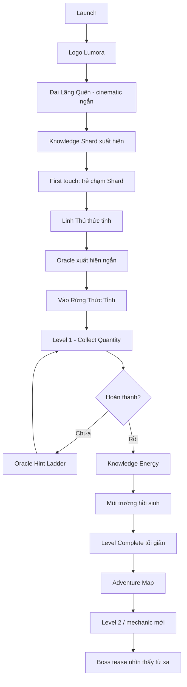
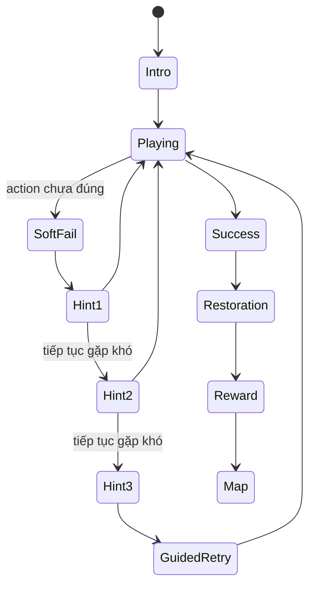

# 10 — UX Flow v0.1

## Mục tiêu

Khóa luồng trải nghiệm MVP trước khi engineering. Trẻ phải được tương tác trong vòng 60 giây đầu và hiểu mục tiêu chủ yếu bằng hình ảnh/animation/voice thay vì đoạn chữ dài.

## First 15-minute canonical flow



## Timing target

| Mốc | Target |
|---|---:|
| Logo + load | 0–5s |
| Intro context | 5–25s |
| First touch | <= 30–45s |
| Linh Thú thức tỉnh | <= 60s |
| Bắt đầu Level 1 | <= 90s |
| First restoration reward | 3–5 phút |
| Mechanic thứ hai | 5–8 phút |
| Boss/mystery tease | <= 15 phút |

## Navigation hierarchy MVP

```text
HOME
├── Tiếp tục hành trình (Primary)
│   └── Adventure Map
│       └── Level
│           ├── Oracle Hint
│           ├── Success / Restoration
│           └── Level Complete
├── Linh Thú
│   └── Progress / Evolution preview
└── Thành phố
    └── Knowledge City

Parent Dashboard: tách entry và giảm prominence trong child UI.
Settings: icon nhỏ, không cạnh tranh với CTA chính.
```

## Child UI rules

- Một màn hình = một hành động chính.
- Mục tiêu phải có thể hiểu bằng visual trong 3–5 giây.
- Touch target lớn.
- Không quá 3 lựa chọn ngang hàng ở child-facing screen nếu không phải gameplay.
- Không yêu cầu đọc đoạn văn dài.
- Voice + animation hỗ trợ những instruction quan trọng.
- Không hiện nhiều currency cùng lúc.

## Level state machine



### Soft fail

Không dùng:
- dấu X đỏ lớn;
- âm thanh thất bại mạnh;
- mất mạng/life;
- punishment currency.

Dùng:
- object rung nhẹ;
- animation chưa hoàn thiện;
- Oracle hoặc environment cue.

## Oracle Hint Ladder

### Hint 0 — Không can thiệp
Cho trẻ cơ hội tự khám phá.

### Hint 1 — Attention cue
Ví dụ: “Con gần đúng rồi. Nhìn những viên sáng này nhé!”

Chỉ highlight vùng cần chú ý.

### Hint 2 — Visual scaffold
Animation từng object/số lượng/pattern liên quan.

### Hint 3 — Step-by-step
Hướng dẫn từng bước nhưng vẫn để trẻ thực hiện thao tác cuối.

### Guided completion
Chỉ dùng khi trẻ đã thất bại nhiều lần và có nguy cơ frustration. Hệ thống dẫn thao tác, nhưng vẫn ghi nhận đây là assisted completion cho mastery model.

## Reward flow

```text
Success
→ Knowledge Energy xuất hiện
→ Energy bay vào Knowledge Core
→ Environment hồi sinh
→ 1 mastery indicator
→ 1 meaningful reward/unlock
→ Back to adventure
```

Target: 3–5 giây cho reward nhỏ; evolution/boss có thể dài hơn.

## Home v0.2 recommendation

Primary focal point: Linh Thú + environment.

Primary CTA:
**Tiếp tục hành trình**

Secondary:
- Linh Thú
- Thành phố

Không hiển thị League/Collection/Rewards như 3 nút cạnh tranh ngang hàng trong MVP.

## Adventure Map v0.2

- Main path sáng rõ.
- Level là địa danh/object trong environment, không phải vòng tròn abstract.
- Boss/mystery nhìn thấy từ xa.
- Side Quest icon khác main quest.
- Secret quest không cần text label.

## MVP gameplay sequence đề xuất

1. Collect Quantity — học control + quantity.
2. Matching/Grouping — reinforcement.
3. Light Bridge — addition embodied.
4. Sorting Stream — compare/classify.
5. Shape Workshop — geometry manipulation.
6. Rune Path — logic/pattern phiên bản đã redesign.
7. Scenario Simulation — phiên bản không story-text.
8. Mixed challenge.
9. Boss phase practice.
10. Boss Kẻ Nuốt Con Số.
11. Evolution cinematic.
12. Knowledge City unlock / epilogue demo.

Không bắt buộc MVP phải có đúng 12 level nếu playtest cho thấy 8–10 level tạo vertical slice tốt hơn.

## Parent transition

Child mode và Parent Dashboard không nên cùng information density.

Parent access cần:
- parent gate phù hợp;
- dashboard sạch hơn game UI;
- weekly insight;
- mastery trend;
- không tạo cảm giác so sánh trẻ với người khác.

## Definition of UX-ready-for-code

Một scene chỉ ready khi có:
1. Entry state.
2. Primary action.
3. Success state.
4. Soft-fail state.
5. Hint behavior.
6. Exit/navigation.
7. Data/mastery event cần ghi nhận.
8. Asset list.

Concept art một mình không đủ điều kiện `ready-for-code`.
